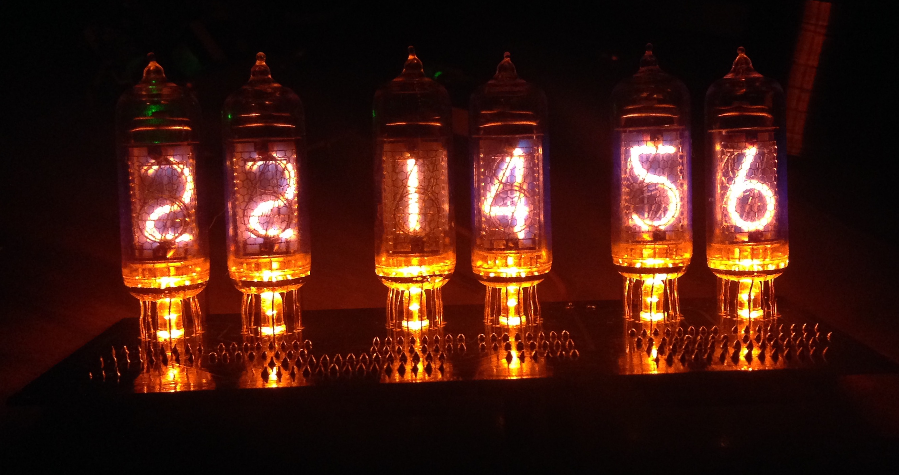

# Nixie Clock

Nixie Clock controlled by I²C.

Project consist from 2 parts:

* Hardware ([PCB](https://en.wikipedia.org/wiki/Printed_circuit_board) + any [I²C](https://en.wikipedia.org/wiki/I%C2%B2C) control device)
* Software

Once creating PCB, you can control your Nixie Clock by any I²C device. Here you can find software to control Nixie Clock by different types I²C devices.

## Hardware

Hardware part consist from 2 parts:

* [Custom PCB](#custom-pcb)
* [I²C Device](#i2c-device)

### Custom PCB

Custom PCB contains all required drivers and [Nixie Tubes](https://en.wikipedia.org/wiki/Nixie_tube), in other words - your clock.

Project within Schematic and PCB is located [here](https://easyeda.com/industral/nixie-clock)

**Schematic**

 

**PCB**

### I2C Device

Any device that has I²C support (usually has [GPIO](https://en.wikipedia.org/wiki/General-purpose_input/output)).
You can use any [SBC](https://en.wikipedia.org/wiki/Single-board_computer) like [Raspberry Pi](https://en.wikipedia.org/wiki/Raspberry_Pi), [Banana Pi](https://en.wikipedia.org/wiki/Banana_Pi) and others or use [single-bord microcontroller](https://en.wikipedia.org/wiki/Single-board_microcontroller) like [Arduino](https://en.wikipedia.org/wiki/Arduino), or even use your own developed board within microcontroller for I²C communication.

  
## Software

If you use SBC that has [OS](https://en.wikipedia.org/wiki/Operating_system) running on, e.g. Linux, and has I²C - you can use software located [here on GitHub](https://github.com/industral/nixie-clock).
You have to upload it into your chosen I²C device, build it and run it.
Using custom I²C device - will require to write your own code in order to control clock via I²C.

For other documentation, please refer to [Documentation](./docs)
